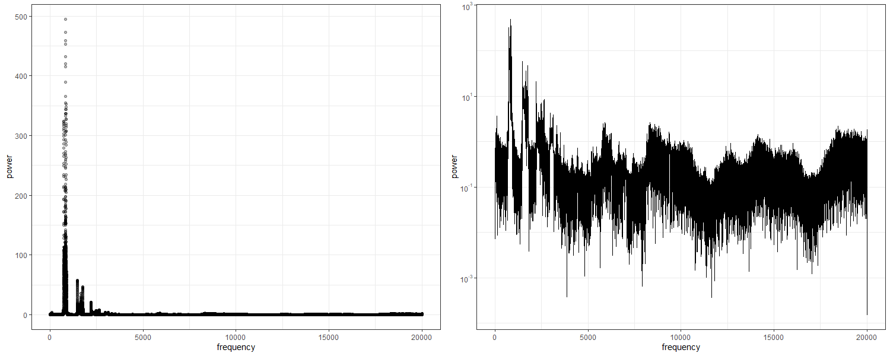

# Processing WAV files with Fast Fourier Transforms in C++
**Jennifer Freeman**

## Description
This program implements the Cooley-Tukey radix-2 fast Fourier Transform (FFT) on a WAV audio file. The user can apply modifying and mixing audio processing effects to output a modified WAV audio file. The frequency-power relationship of the input signal can also be determined when modifying effects are applied.
### Cooley-Tukey radix-2 FFT algorithm

An FFT is as algorithm for efficiently computing the Discrete Fourier Transform (DFT) on a data set. For a vector of data $x$ of size $N$ the DFT is defined as:
$$X[k]=\sum_{n=0}^{N-1} x[n]e^{\frac{-2\pi i nk}{N}}$$
The Cooley-Tukey radix-2 FFT algorithm computes the FFT for a complex data set of size $N=2^m$. Given this N we can partition the DFT into two parts.

$$X[k]=\underbrace{\sum_{m=0}^{N/2-1} x[2m]e^{\frac{-2\pi i mk}{N/2}}}_{\text{$x_{even}$}} + \underbrace{e^{\frac{-2\pi i k}{N}}}_{\text{$W_N^k$}}\underbrace{\sum_{m=0}^{N/2-1} x[2m+1]e^{\frac{-2\pi i mk}{N/2}}}_{\text{$x_{odd}$}}$$

The first summation $x_{even}$ contains the even indices of $x$, $x_{odd}$ contains the odd indices, and $W_N^k$ is called the *twiddle* factor. Using the fact that $e^{z+2\pi i} = e^z$, then the following relationship holds:

$$X[k] = x_{even}^k + W_N^k x_{odd}^k, \quad X[k+N/2] = x_{even}^k - W_N^k x_{odd}^k$$

This saves additional computations since each $x_{even}^k$ $x_{odd}^k$ can be used for two different DFT calculations. Since $N$ is a power of 2, $N$ can be successively halved and the algorithm recursively computes the DFT [^1]. This recursive quality leads to a computationally efficient algorithm.

### Computational Aspects

Although the Cooley-Tukey radix-2 FFT algorithm provides some computational boost to computing the DFT individually, the algorithm will be slower for large signals. Additionally, large signals occupy more space in memory.

To account for this the program implements a *windowing* method for signals that contain more than $2^{18}$ elements. 

The windowing method goes as follows:

1. The signal is split into $2^{18}$-sized chunks. Note the signal size is always a power of two, so an integer number of chunks will be obtained.
2. For each pair of consecutive chunks,
    * Multiply the first chunk by a linear ramp. The linear ramp is a $2^{18}$-sized vector with the first element 0 and the last element 1, and the remaining elements are equally spaced and increasing.
    * Multiply the second chunk by the inverse of the linear ramp (the ramp starts at 1 and ends at 0).
    * Concatenate the first chunk and second chunk into one. On this larger chunk perform the FFT, any processing effects and the inverse FFT.
    * Move to the next pair of chunks (i.e. chunk two and chunk three)
3. Rebuild the signal by summing the inverse FFT output from each chunk. All but the first and last chunks will have had both positive and negative linear ramps applied, so the summation will rebuild the signal at the appropriate amplitude. This is often-called the *overlap-add* method.

### Frequency-Power Relationship 

The frequency-power relationship of an input signal is computed after the FFT is performed. The periodogram describes the relationship between signal frequency components and power, where power describes how often that frequency appears in the signal. Using Welch's method we can obtain the frequency-power relationship for the entire signal even when the window and overlap-add method is used [^5]. For large signals processed in chunks, the periodogram is computed by finding the average modulus of the FFT values in all chunks.

### Modifying Effects
#### Digital filters

A digital filter is an operation in signal processing that alters specific frequency components within a signal [^2]. In an audio signal, we can apply digital filters to reduce or enhance specific frequencies.

##### Low-pass filter

A low-pass digital filter attenuates frequencies above some threshold frequency and allows all lower frequencies to "pass" through the filter. The simplest low-pass frequency is called a *sharp cut-off* filter where all frequencies above the threshold are removed and all other frequencies remain unchanged [^2].

To apply the low-pass sharp cut-off filter to an audio file, an FFT is performed to produce the frequency spectrum $X[k]$ of size $N$. A frequency $f$ occurs at the $k$-th value of $X$ and satisfies $f = f_{samp}k/N$ where $f_{samp}$ is the sampling rate of the the audio signal. For a given frequency, $k$ can be solved for and the resulting $X[k]$ values can be set to zero. The inverse FFT is then performed on the modified $X[k]$ and the resulting filtered audio signal is obtained. 

##### High-pass filter

A high-pass digital filter is the opposite of a low-pass filter. Frequencies below a specified frequency are attenuated and all frequencies above are unchanged. For a given frequency, the index that corresponds to this frequency bin from the FFT computation can be computed as described above and all lower frequencies are zeroed out.

##### Band-pass filter

A band-pass filter attenuates all frequencies outside of some frequency range $f_1$ and $f_2$, where $f_1 < f_2$. All frequencies contained within the *band* between $f_1$ and $f_2$ are unchanged.

#### Equalization

Equalizing an audio signal allows for attenuation and boosting within frequency *bands*. Frequency bands are often preset ranges in the audible frequency range that correspond to groups of ranges that are often modified together. For example frequencies between 60 Hz to 250 Hz describe a Bass band, and equalization effects can be applied to the entire band [^3].

This program uses 10 preset frequency bands with band centres located at:
 32 Hz, 63 Hz, 125 Hz, 250 Hz, 500 Hz, 1 kHz, 2 kHz, 4kHz, 8kHz, 16 kHz

 The width of the each band can be computed using $f_{lower}=f_c/\sqrt{2}$ and $f_{upper}=f_c \sqrt{2}$ for a frequency band centre $f_c$ [^4].

 To increase or decrease a frequency band by decibel value, we can compute the relative *gain* which equals $10^{A/20}$ for a decibel change $A$. 

 By computing the FFT of the signal, the gains are multiplied by the values in the frequency domain and the modified signal can be obtained by performing the inverse FFT.

### Mixing

Mixing effects involve incorporating multiple signals into one. This program implements two simple mixing techniques. 

Two audio signals can be concatenated into one, by concatenating the second signal after the first.

Given two vectors containing the amplitudes of two audio signals, the signals can be over layed by summing the element-wise amplitude components. For large amplitudes that overflow, the signal might need to be scaled.

## Program Input

The program takes a variable number of arguments depending on the desired audio processing to perform.

The first two input arguments are: 
1. A WAV audio file name with a maximum file size of 12 MB. Example: "in_file.wav"
2. The name of an output WAV audio file name. Example "out_file.wav"

The remaining arguments describe the type of audio processing to perform.

### Modifying Effects

**Low-pass filter**

3. Low-pass filter identifier `low`.
4. Frequency value between (20-20000) Hz to apply the low-pass filter.
   
   *Example command line input* 
   `FFT_audio alphabet.wav output.wav low 2000`

**High-pass filter**

3. High-pass filter identifier `high`.
4. Frequency value between (20-20000) Hz to apply the high-pass filter.
   
   *Example command line input* 
   `FFT_audio alphabet.wav output.wav high 1000`

**Band-pass filter**

3. Band-pass filter identifier `band`.
4. First frequency value between (20-20000) Hz for the lower threshold on the band-pass filter.
5. Second frequency value between (20-20000) Hz for the upper threshold on the band-pass filter. The second frequency must be larger than the first frequency.
   
   *Example command line input* 
   `FFT_audio alphabet.wav output.wav band 600 1000`

**Equalizing**

3. Equalizing identifier `equalize`.
4. Ten integer decibel values between -24dB to 24dB to apply to the ten preset frequency bands. A decibel value of 0 will apply no change to the frequency band.
   
   *Example command line input* 
   `FFT_audio alphabet.wav output.wav equalize -12 0 1 8 -3 22 0 0 3 14`

### Mixing Effects

To mix signals the two input WAV files must contain the same number of channels. If the sampling rate differs between the two signals, the larger sampling rate will be used in the output file.

**Concatenating Signals**

3. Concatenating identifier `add`.
4. A WAV audio file name with a maximum file size of 12 MB to be concatenated after the first WAV file. 
   
    *Example command line input* 
    `FFT_audio alphabet.wav output.wav add piano.wav`

**Overlapping Signals**

1. Overlapping identifier `overlap`.
2. A WAV audio file name with a maximum file size of 12 MB to be overlapped with the first WAV file. 
   
    *Example command line input* 
    `FFT_audio alphabet.wav output.wav overlap piano.wav`

## Program Output

The program outputs a WAV audio file named with the second input argument containing the processed input audio signal. 

If modifying effects are performed the periodogram is calculated, and an output csv file is created with the array of frequency bin versus power measurements. For a one channel input audio file, the file is named *periodogram.csv*. For a two channel input audio file, the periodogram is computed for each channel. The files are named *periodogram_leftchannel.csv* and *periodogram_rightchannel.csv* for the left and right channels respectively.

The following is the periodogram of the *"female_sing.wav"* file. By viewing the signal in the frequency domain we can determine what processing effects may achieve the desired output signal.

## References

[^1]: Bekele, A. J. Advanced Algorithms. (2016). Cooley-tukey fft algorithms. Advanced algorithms.

[^2]: O'Haver, T. (2019, December). Fourier filter. Retrieved December 12, 2021, from https://terpconnect.umd.edu/~toh/spectrum/FourierFilter.html

[^3] What is Graphic EQ? Retrieved December 19, 2021, from https://www.presonus.com/learn/technical-articles/What-Is-a-Graphic-Eq

[^4] Octave band. Retrieved December 17, 2021, from https://en.wikipedia.org/wiki/Octave_band

[^5] Welch, P. (1967). The use of fast Fourier transform for the estimation of power spectra: a method based on time averaging over short, modified periodograms. IEEE Transactions on audio and electroacoustics, 15(2), 70-73.